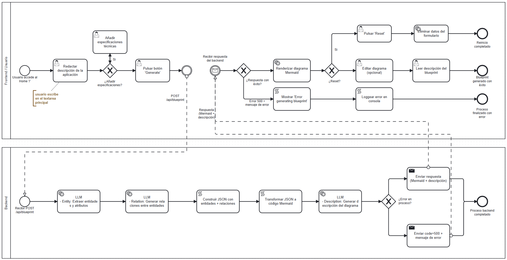

# Flujo del Usuario (Frontend)

1. **Entrada al Home ('/'):**

   El proceso comienza cuando el usuario accede al home de la aplicación, ubicado en la ruta raíz /. En este punto, el usuario tiene acceso a un área de texto (textarea) donde puede redactar una descripción de la aplicación que desea crear.

2. **Selección de Especificaciones:**

   Después de que el usuario haya escrito la descripción inicial, puede personalizar aún más su solicitud seleccionando varias especificaciones de entre las opciones predeterminadas. Esto incluye la elección de frameworks como `["Django", "Flask", "React", "Angular", "Spring Boot"]` y bases de datos como `["PostgreSQL", "MongoDB", "MySQL", "Redis", "SQLite"]`.

3. **Generación del Diagrama (Botón "Generate"):**

   Una vez completada la descripción y las especificaciones, el usuario pulsa el botón "**Generate**". Esto inicia una solicitud asíncrona hacia el backend y redirige al usuario a la página /blueprint (o SPA si se considera necesario). En esta nueva página se muestra lo siguiente:

   - ** Lado izquierdo:** La descripción que el usuario proporcionó.

   - **Parte central:** El diagrama de clases generado dinámicamente mediante mermaid.js. Este diagrama es interactivo y el usuario tiene la opción de editarlo si lo desea, a través de un botón habilitado para ello.

4. **Opción de Reinicio (Botón "Reset"):**
   Si el usuario decide empezar desde cero, puede hacer clic en el botón "**Reset**", lo que lo llevará nuevamente a la página de inicio /, eliminando toda la información previamente ingresada.

# Flujo del Backend

1.  **Petición del Frontend al Backend:**

    Al pulsar el botón "**Generate**", el frontend realiza una solicitud POST asíncrona a la ruta `/api/blueprint`. En el cuerpo de la petición se incluyen:

    - La descripción redactada por el usuario.

    - Las especificaciones seleccionadas (frameworks, bases de datos, etc.).

2.  **Procesamiento de la Descripción en el Backend:**

    Al recibir la solicitud, el backend comienza su proceso de análisis y generación de los componentes del diagrama. El flujo se desglosa en los siguientes pasos:

    - **Extracción de Entidades y Atributos (LLM - Entity):**

      Un primer Language Model (LLM) analiza la descripción y las especificaciones proporcionadas por el usuario, extrayendo las entidades y atributos relevantes para el diagrama de clases.

    - **Generación de Relaciones entre Entidades (LLM - Relation):**

      Un segundo LLM toma como entrada la descripción, las especificaciones y las entidades generadas por el primer modelo, y devuelve las relaciones entre esas entidades. Esto es fundamental para definir cómo interactúan las distintas partes de la aplicación.

    - **Generación del JSON (Formato Intermedio):**

      A partir de la salida de los dos LLMs, el backend genera un objeto JSON que describe las entidades y sus relaciones. Este formato se utiliza para facilitar el siguiente paso del proceso.

    - **Conversión a Código Mermaid:**

      El JSON generado en el paso anterior se transforma a código mermaid.js, el cual es interpretado por el frontend para generar el diagrama de clases visualizado en la interfaz de usuario.

    - **Generación de la Explicación del Diagrama (LLM - Description):**

      Finalmente, un tercer LLM recibe el JSON resultante y genera una explicación detallada del código mermaid. Esta explicación es luego enviada junto con el diagrama y sirve para proporcionar contexto al usuario sobre el diseño y las relaciones en el diagrama de clases.

3.  **Respuesta del Backend al Frontend:**

    Una vez procesada toda la información, el backend responde con los siguientes datos:

    - El **código mermaid** generado para el diagrama.

    - La **descripción del diagrama**, que incluye:
      - **Título** del diagrama.
      - **Visión general** del diagrama.
      - **Componentes** que explican las entidades y sus relaciones en el diagrama.

4.  **Manejo de Errores:**

    En caso de que ocurra algún error durante el proceso de generación (por ejemplo, un fallo en los modelos LLM o en la conversión de los datos), el backend devolvería un código de error **500** junto con un mensaje descriptivo del fallo. En el frontend, esta situación se refleja mostrando el mensaje "**Error generating blueprint**" en rojo, tanto en los contenedores del diagrama como en los logs de la consola. Sin embargo, idealmente, este error no debería ocurrir bajo condiciones normales de operación.
